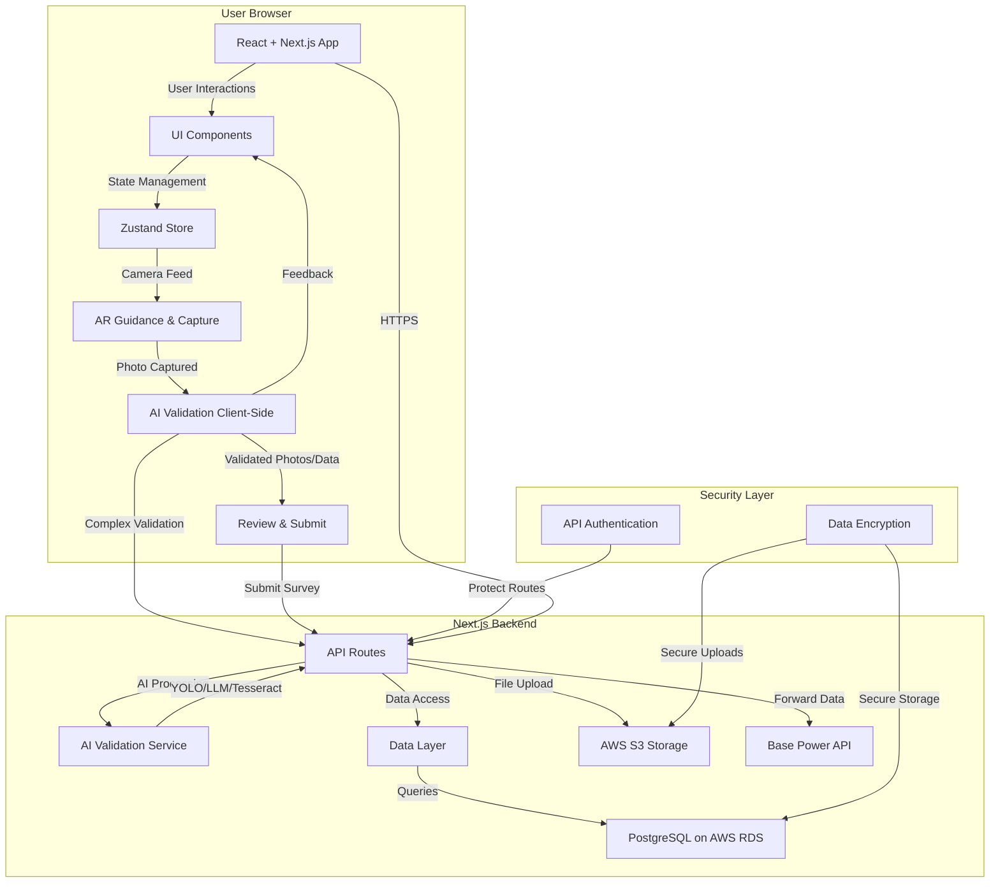

# Base Power Survey App - System Architecture

The Base Power Company Site Survey Application is designed with a clear separation between client-side (user browser) and server-side (Next.js backend) components, supported by a robust security layer and cloud infrastructure.

## 1. Client-Side (User Browser)

The user interacts with a React + Next.js application, which handles the user interface, state management, and initial data capture and validation.

- **React + Next.js App:** The primary interface for users.
- **UI Components:** Reusable components built with ShadCN and custom elements.
- **Zustand Store:** Manages the application's state, including survey steps, captured photos, and data.
- **Camera Feed:** Provides live video for AR guidance and photo capture.
- **AI Validation (Client-Side):** Performs initial validation of captured photos (e.g., image quality checks).
- **Review & Submit:** Allows users to review collected data and photos before submission.

## 2. Server-Side (Next.js Backend)

The backend handles API routes, complex AI validation, data persistence, and integration with external services.

- **Next.js API Routes:** Serve as the primary API endpoints for the client-side application.
- **AI Validation Service:** Processes images using multimodal LLMs for post-picture analysis and potentially YOLO for advanced object detection.
- **Data Layer:** Manages interactions with the PostgreSQL database.
- **AWS S3 Storage:** Securely stores uploaded photos.
- **Base Power API:** An external API where the final survey data is forwarded.

## 3. Security Layer

Ensures the protection of data and secure communication within the system.

- **API Authentication:** Secures access to backend API routes.
- **Data Encryption:** Protects sensitive data at rest and in transit.

## System Architecture Diagram

