---
## 1. Client – User Browser
The client is a React application built with the Next.js **App Router**.

• **UI Layer** – Components from `shadcn/ui` plus custom elements provide the interface. 
• **State Management** – A single Zustand store (`stores/surveyStore.ts`) tracks survey progress, photos, and validation results. 
• **Camera & AR Guidance** – Components in `components/Camera*` render the live camera feed and optional overlay guides (`lib/photoOverlays.ts`). 
• **Local Validation Trigger** – When a photo is captured the client instantly requests validation (see API below) so the user receives fast feedback. 
• **Review & Submit** – After all required photos are captured the user reviews the set and submits the survey metadata.

> Future 🔭 A lightweight YOLO model will run **on-device** inside the Camera/AR layer to give real-time framing hints.  It is not in production yet and is therefore dashed in the diagram.

---
## 2. Backend – Next.js API Routes
All server logic lives inside the same Next.js project under `app/api/*`.

| Route | Responsibility |
|-------|----------------|
| `/api/validate` | Calls an external multimodal LLM (OpenAI Vision) to grade each photo and optionally extract data. |
| `/api/surveys/photos` | Generates presigned **PUT** URLs for S3 so the browser can upload images directly and privately. |
| `/api/surveys` | Persists survey metadata, validation JSON and skipped-step info to Postgres.  It also returns data for admin dashboards. |
| `/api/photos/[photoId]` | Provides time-limited download links for already-stored photos. |

The backend uses the `pg` library for SQL access (`lib/db.ts`) and `@aws-sdk/*` for S3 operations (`lib/aws.ts`).

---
## 3. Cloud Infrastructure (AWS)
• **Amazon S3** – Stores original JPEGs.  Files are uploaded under a temporary prefix and can be moved server-side if needed. 
• **Amazon RDS → PostgreSQL** – Holds customers, surveys, photos and validation results. 
• **AWS IAM** – Minimal scoped keys used only for S3 access from the server.

---
## 4. Security Layer
• **HTTPS everywhere** – Enforced by the Vercel/Next.js deployment. 
• **x-internal-api-key header** – Required for any external integrations hitting the API routes directly. 
• **S3 presigned URLs** – Ensure the browser never gains broad write permissions.

---
## 5. System Architecture Diagram

```mermaid
graph TD
  %% === Client Side ===
  subgraph Client["User Browser"]
    UI["Next.js App (React / shadcn)"] --> State["Zustand Store"]
    State --> Camera["Camera View + AR Guidance"]
    Camera -->|"capture"| Preview["Photo Preview"]
    Preview -->|"/api/validate"| ValidateReq
    Preview -->|"/api/surveys/photos"| PresignReq
    Preview --> Review["Review & Submit"]
  end

  %% === Backend ===
  subgraph Backend["Next.js API Routes"]
    ValidateReq --> ValidateRoute["validate route"]
    ValidateRoute -->|"OpenAI Vision"| LLM["LLM Service"]

    PresignReq --> PhotosRoute["photos route"]
    PhotosRoute -->|"Presigned URL"| S3[("AWS S3")]

    Review --> SurveysReq["/api/surveys"]
    SurveysReq --> SurveysRoute["surveys route"]
    SurveysRoute --> Postgres[("PostgreSQL – AWS RDS")]
    SurveysRoute --> S3
  end

  %% === Storage ===
  S3
  Postgres

  %% === Security ===
  subgraph Security
    Auth["HTTPS + API Key"]
  end
  Auth --- ValidateRoute
  Auth --- PhotosRoute
  Auth --- SurveysRoute

  %% === Future Work ===
  Camera -.-> YOLO["YOLO Object Detection (future)"]
```

---
